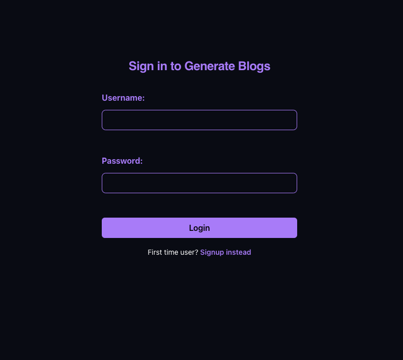
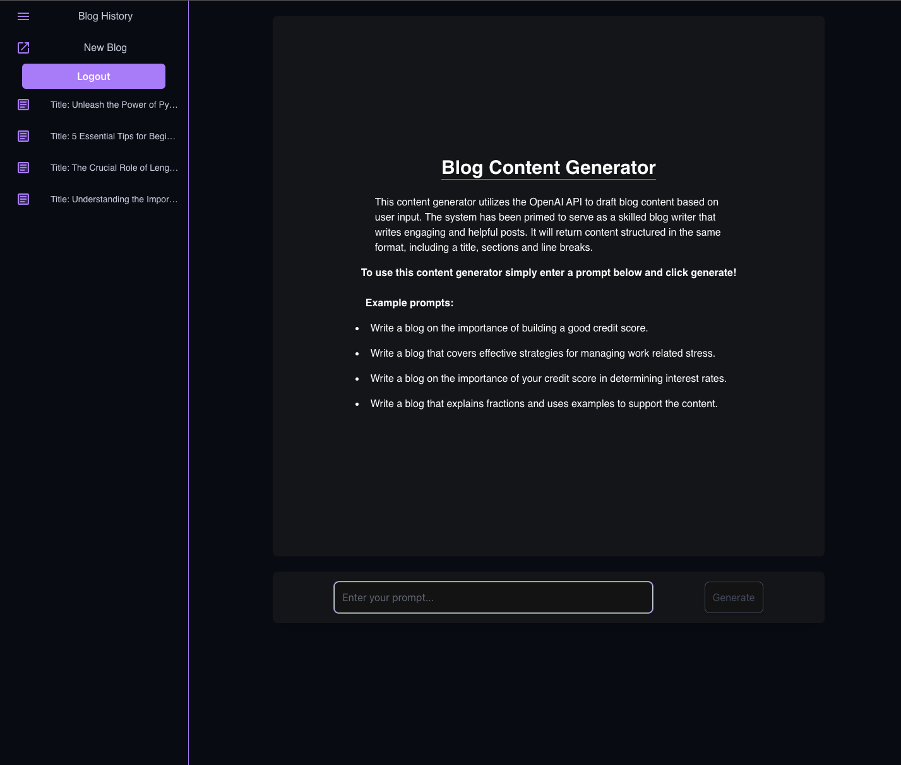
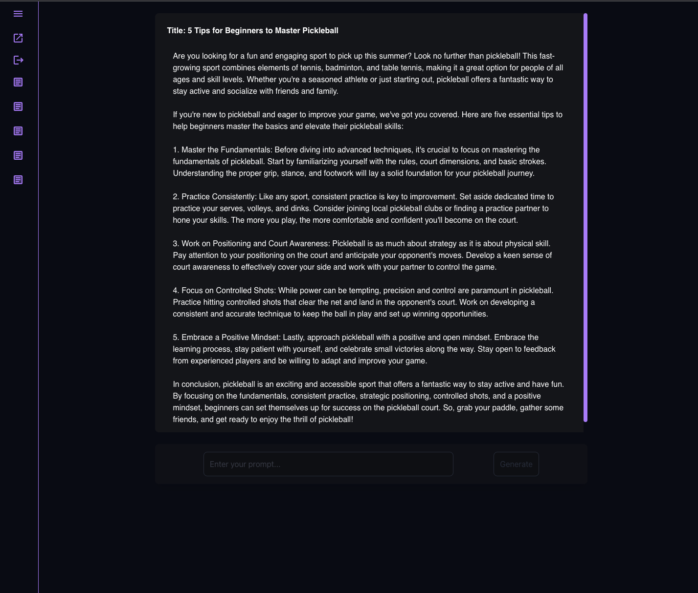

# AI Blog Writer 

## Description
This full stack application utilizes the OpenAi API to generate blog content based on user inputted prompts. A user will need to login or signup to access the service. Once enrolled, a user can enter a prompt following the examples on the home screen. After selecting generate, a request will be sent to the applications API. This will trigger a request to the OpenAI API that has been primed with instructions on writing style and how to format the generated content. Once the requested content has been generated, it will be rendered in the client and saved to the data base for future reference. 

This projects backend consists of a Flask application with a Flask-RESTful API. Data for this application is stored in a PyMySQL db. It is queried using SQLAlchemy, encrypted using Flask-Bcrypt and auth is managed using Flask-JWT.

The client is built in React and styled with Tailwind.css. Routing is managed with React-Router and the color theme and icons are provided by Material UI. 

## Table of Contents

- [Installation](#installation)
- [Technologies Used](#technologies-used)
- [Application Examples](#application-examples)
- [Contributors](#contributors)
- [Deploy](#deploy)
- [License](#license)
- [Repository](#repository)

## Installation

```
npm install
npm run seed
npm run develop
```

## Technologies Used

          

## Application Examples





### Application demo: 
* https://drive.google.com/file/d/17Wmr2hOncYYebrwmjOL1Qvrtazvtpv5Y/view?usp=sharing


## Contributors

* [Chase Ostien](https://github.com/ChaseOstien)

## Deploy

Deployed Application:
* Hello

## License

ISC License:

* https://opensource.org/licenses/ISC

## Repository

- GitHub: [Blog-Writer](https://github.com/ChaseOstien/OpenAI-Blog-Writer)